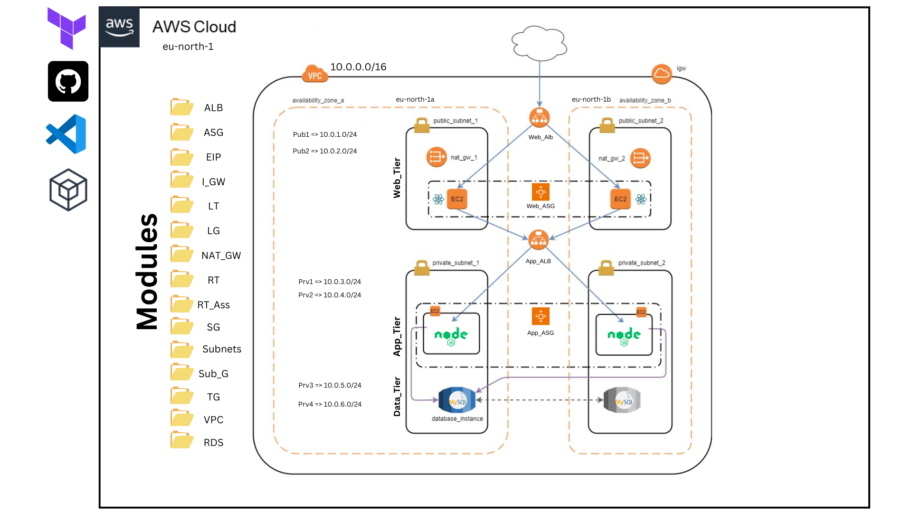

# PFS 3-Tier Architecture on AWS with Terraform

## Overview
Successfully completed a comprehensive 3-tier architecture project on AWS using Terraform, creating a scalable, fault-tolerant, and secure system. This README provides an insightful overview of the project.

## Made by
- BAMGHARI ILIASS

## Project Description

### 1. Web Tier:
- **Front-end:** Developed a dynamic React app on port 3000.
- **Deployment:** Utilized Auto Scaling Groups in public subnets with an Application Load Balancer for efficient load balancing.

### 2. App Tier:
- **Back-end:** Implemented an application operating on port 8080.
- **Deployment:** Ensured high availability with Auto Scaling Groups across 2 availability zones. Security maintained through private subnets. An Application Load Balancer exclusively manages traffic for the App Tier.

### 3. Data Tier:
- **Database:** Managed data efficiently with a MySQL Database hosted on Amazon RDS.

## Architecture Diagram

## Deployment Process

### Terraform:
- Orchestrated the entire infrastructure seamlessly with Terraform.
- Ensured scalability and reproducibility.

## Key Accomplishments
- Implemented dual Application Load Balancers for Web and App Tiers.
- Executed multi-Availability Zone deployment using Auto Scaling Groups.
- Ensured secure networking with a combination of public and private subnets.
- Achieved optimal database management with Amazon RDS.
- Streamlined the deployment process through Terraform and Bash scripting.

## Acknowledgments
- Gratitude to Professor Mr. Hamada EL KABTANE and Mr. Khalid El Baamrani for their invaluable guidance and support.
- Special thanks to everyone who supported us throughout this journey.

## Future Outlook

Excited for the future of cloud architecture and Terraform. Looking forward to building, learning, and growing together in the realm of cloud computing.

## Getting Started

To deploy this project, follow these steps:

1. Clone the repository to your local machine.
2. Set up your AWS credentials and configure Terraform.
3. Navigate to the Terraform directory and run `terraform init`.
4. Customize the Terraform variables in `terraform.tfvars`.
5. Execute `terraform apply` to deploy the infrastructure.

## App Repository
Find the source code for the app in our [GitHub Repository](https://github.com/iliass-bamghari/PFS).

## Conclusion

Thank you for considering our project. We're excited about the possibilities in cloud architecture and Terraform. Let's continue pushing boundaries and learning together! 🚀💻
